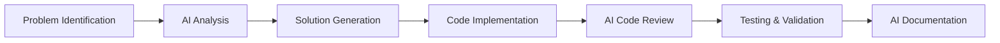

# Selenium PyTest Framework with BDD Testing

[](https://github.com/YOUR_USERNAME/selenium-pytest-framework/actions/workflows/ci.yml)
[](https://codecov.io/gh/YOUR_USERNAME/selenium-pytest-framework)

A comprehensive Selenium-based testing framework using PyTest with Behavior-Driven Development (BDD) approach, featuring multi-browser support, comprehensive reporting, and CI/CD integration.

## 🚀 Features

- **BDD Testing**: All tests written in Given-When-Then format for clear, readable test scenarios
- **Multi-Browser Support**: Chrome, Firefox, Edge with automatic WebDriver management
- **Comprehensive Reporting**: HTML, JSON, XML, JUnit, Allure reports with detailed metrics
- **CI/CD Integration**: GitHub Actions workflow with multi-browser testing matrix
- **Page Object Model**: Clean, maintainable page object implementation
- **Screenshot Capture**: Automatic screenshot capture on test failures
- **Performance Monitoring**: Test execution time analysis and performance metrics
- **Coverage Reporting**: Code coverage analysis and reporting

## 🏗️ Project Structure

```
selenium_pytest_framework/
├── .github/
│   └── workflows/
│       └── ci.yml                 # GitHub Actions CI/CD workflow
├── config/
│   ├── settings.py                # Configuration settings
│   └── demoblaze_test_data.py     # Test data configuration
├── pages/
│   ├── base_page.py               # Base page object class
│   ├── demoblaze_home_page.py     # Home page object
│   └── demoblaze_cart_page.py     # Cart page object
├── tests/
│   ├── test_demoblaze_add_to_cart_bdd.py     # BDD: Add to cart scenarios
│   ├── test_demoblaze_checkout_bdd.py        # BDD: Checkout scenarios
│   ├── test_demoblaze_e2e_bdd.py             # BDD: End-to-end scenarios
│   ├── test_demoblaze_navigation_bdd.py      # BDD: Navigation scenarios
│   └── test_demoblaze_product_display_bdd.py # BDD: Product display scenarios
├── utilities/
│   └── test_reporter.py           # Comprehensive test reporting utility
├── reports/                       # Generated test reports
├── screenshots/                   # Test failure screenshots
├── conftest.py                    # PyTest configuration and fixtures
├── pytest.ini                    # PyTest settings and reporting config
└── requirements.txt               # Project dependencies
```

## 🛠️ Setup and Installation

### Prerequisites

- Python 3.9 or higher
- Git
- Chrome, Firefox, or Edge browser

### Local Setup

1. **Clone the repository:**
   ```bash
   git clone https://github.com/YOUR_USERNAME/selenium-pytest-framework.git
   cd selenium-pytest-framework
   ```

2. **Create and activate virtual environment:**
   ```bash
   # Windows
   python -m venv venv
   venv\Scripts\activate

   # macOS/Linux
   python3 -m venv venv
   source venv/bin/activate
   ```

3. **Install dependencies:**
   ```bash
   pip install -r requirements.txt
   ```

4. **Install WebDriver dependencies:**
   ```bash
   # WebDriver Manager will automatically download drivers
   python -c "from webdriver_manager.chrome import ChromeDriverManager; ChromeDriverManager().install()"
   ```

## 🧪 Running Tests

### Basic Test Execution

```bash
# Run all tests
pytest

# Run specific test file
pytest tests/test_demoblaze_e2e_bdd.py

# Run with specific browser
pytest --browser=chrome
pytest --browser=firefox
pytest --browser=edge

# Run in headless mode
pytest --headless

# Run with verbose output
pytest -v
```

### Advanced Test Options

```bash
# Generate comprehensive reports
pytest --html=reports/test-report.html --self-contained-html

# Run with coverage analysis
pytest --cov=pages --cov=utilities --cov-report=html

# Run specific test scenarios (by markers)
pytest -m "smoke"
pytest -m "e2e"
pytest -m "checkout"

# Parallel execution (if pytest-xdist is installed)
pytest -n 4
```

## 📊 Test Reporting

The framework generates multiple types of reports:

### 1. HTML Reports
- **Location**: `reports/test-report.html`
- **Features**: Interactive HTML report with test results, screenshots, and execution details

### 2. JSON Reports
- **Location**: `reports/json-report.json`
- **Features**: Machine-readable test results for further analysis

### 3. JUnit XML Reports
- **Location**: `reports/junit-report.xml`
- **Features**: Standard XML format for CI/CD integration

### 4. Allure Reports
- **Location**: `reports/allure-report/`
- **Features**: Advanced reporting with trends, history, and detailed analytics

### 5. Coverage Reports
- **Location**: `reports/coverage-html/`
- **Features**: Code coverage analysis with line-by-line coverage details

### 6. Comprehensive Test Summary
The `TestReporter` utility generates detailed metrics including:
- Test execution summary (total, passed, failed, skipped)
- Performance metrics (execution times, tests per minute)
- Failure analysis with error categorization
- Browser-specific results comparison

## 🔄 CI/CD Integration

### GitHub Actions Workflow

The project includes a comprehensive GitHub Actions workflow that:

- **Multi-Browser Testing**: Tests across Chrome, Firefox, and Edge
- **Multi-Python Versions**: Tests with Python 3.9, 3.10, 3.11, and 3.12
- **Automated Reporting**: Generates and uploads comprehensive test reports
- **Performance Monitoring**: Tracks test execution performance across browsers
- **PR Comments**: Automatically comments on pull requests with test results
- **Artifact Collection**: Preserves test reports, screenshots, and coverage data

### Setting up CI/CD

1. **Create GitHub Repository:**
   ```bash
   git remote add origin https://github.com/YOUR_USERNAME/selenium-pytest-framework.git
   git branch -M main
   git push -u origin main
   ```

2. **Configure Codecov (optional):**
   - Sign up at [codecov.io](https://codecov.io)
   - Add your repository
   - The workflow will automatically upload coverage data

3. **Workflow Triggers:**
   - Push to `main` or `develop` branches
   - Pull requests to `main` or `develop` branches
   - Manual trigger via GitHub Actions UI

## 🧩 BDD Test Structure

All tests follow the Behavior-Driven Development (BDD) approach with clear Given-When-Then structure:

```python
class TestDemoBlazeE2EBDD:
    """BDD test scenarios for end-to-end DemoBlaze functionality"""

    def test_complete_single_product_purchase_journey_bdd(self, setup_browser):
        """
        Scenario: User completes a single product purchase journey
        Given: User is on the DemoBlaze homepage
        When: User selects a product, adds it to cart, and completes checkout
        Then: User should see purchase confirmation
        """
        # Given: User is on the DemoBlaze homepage
        home_page = DemoBlazeHomePage(setup_browser)
        home_page.navigate_to_homepage()
        
        # When: User selects a product and adds it to cart
        home_page.click_product_by_name("Samsung galaxy s6")
        home_page.wait_for_product_detail_page()
        home_page.click_add_to_cart()
        
        # ... rest of the test implementation
```

## 🎯 Test Categories

Tests are organized by functionality with appropriate markers:

- **Navigation Tests** (`@pytest.mark.navigation`): Homepage navigation and menu functionality
- **Product Display Tests** (`@pytest.mark.product_display`): Product listing and detail views
- **Add to Cart Tests** (`@pytest.mark.add_to_cart`): Shopping cart functionality
- **Checkout Tests** (`@pytest.mark.checkout`): Purchase process and form validation
- **E2E Tests** (`@pytest.mark.e2e`): Complete user journey scenarios

## 🔧 Configuration

### Browser Configuration
Configure default browser and settings in `config/settings.py`:

```python
# Default browser configuration
DEFAULT_BROWSER = "chrome"
HEADLESS_MODE = False
IMPLICIT_WAIT = 10
PAGE_LOAD_TIMEOUT = 30
```

### Test Data Configuration
Test data is centralized in `config/demoblaze_test_data.py`:

```python
# Test user data
TEST_USERS = {
    "valid_user": {
        "name": "John Doe",
        "country": "USA",
        "city": "New York",
        "card": "1234567890123456",
        "month": "12",
        "year": "2025"
    }
}
```

## 📈 Performance Monitoring

The framework includes built-in performance monitoring:

- **Execution Time Tracking**: Measures individual test execution times
- **Browser Performance Comparison**: Compares performance across different browsers
- **Threshold Monitoring**: Alerts when tests exceed performance thresholds
- **Trend Analysis**: Tracks performance trends over time in CI/CD

## 🚨 Troubleshooting

### Common Issues

1. **WebDriver Issues:**
   ```bash
   # Update WebDriver
   pip install --upgrade webdriver-manager
   ```

2. **Permission Issues (Windows):**
   ```bash
   # Run as administrator or check antivirus settings
   ```

3. **Port Conflicts:**
   ```bash
   # Check if other services are using default ports
   netstat -an | findstr :4444
   ```

4. **Browser Not Found:**
   ```bash
   # Verify browser installation paths
   # Update browser to latest version
   ```

## 🤝 Contributing

1. Fork the repository
2. Create a feature branch: `git checkout -b feature/new-feature`
3. Make your changes following BDD principles
4. Add tests for new functionality
5. Ensure all tests pass: `pytest`
6. Submit a pull request

## 📝 License

This project is licensed under the MIT License - see the [LICENSE](LICENSE) file for details.

## 🔗 Useful Links

- [Selenium Documentation](https://selenium-python.readthedocs.io/)
- [PyTest Documentation](https://docs.pytest.org/)
- [WebDriver Manager](https://github.com/SergeyPirogov/webdriver_manager)
- [Allure Framework](https://docs.qameta.io/allure/)
- [GitHub Actions](https://docs.github.com/en/actions)

## 📊 Test Execution Metrics

The framework provides comprehensive metrics after each test run:

```
=== Comprehensive Test Execution Report ===
Execution Summary:
- Total Tests: 45
- Passed: 42 (93.33%)
- Failed: 2 (4.44%)
- Skipped: 1 (2.22%)

Performance Metrics:
- Total Execution Time: 127.45 seconds
- Average Test Duration: 2.83 seconds
- Tests per Minute: 21.19

Browser Coverage:
- Chrome: 15 tests
- Firefox: 15 tests  
- Edge: 15 tests
```

---

**Happy Testing!** 🎉

For questions or support, please open an issue in the GitHub repository.
# Run all DemoBlaze tests
python -m pytest tests/test_demoblaze_e2e.py -v

# Run specific test
python -m pytest tests/test_demoblaze_e2e.py::TestDemoBlazeECommerce::test_successful_login -v

# Generate HTML report
python -m pytest tests/test_demoblaze_e2e.py -v --html=reports/test_report.html --self-contained-html
```

## 🧪 Test Scenarios Covered

### 1. Successful Login
- ✅ Enter valid credentials (test/test)
- ✅ Validate redirection to main page
- ✅ Verify presence of logout button/username

### 2. Product Browse & Add to Cart
- ✅ Navigate to product listings
- ✅ Select products from different categories
- ✅ Add multiple products to cart
- ✅ Verify success messages and cart updates

### 3. Shopping Cart Verification
- ✅ Verify correct products in cart
- ✅ Validate quantities and prices
- ✅ Confirm total price calculation

### 4. Checkout Process (Happy Path)
- ✅ Proceed from cart to checkout
- ✅ Fill shipping and payment information
- ✅ Complete order
- ✅ Verify order confirmation with order number

## 🤖 AI-Powered Website Analysis

### Analyze Any Website
```bash
# Analyze website structure
python mcp_server/mcp_cli.py analyze-website https://www.demoblaze.com detailed

# Generate complete test suite from website
python mcp_server/mcp_cli.py generate-tests-from-url https://example.com functionality,forms,navigation
```

### MCP Server Features
- **Deep HTML Analysis**: Identifies forms, buttons, links, and interactive elements
- **Smart Test Generation**: Creates page objects and test cases automatically
- **Intelligent Recommendations**: Suggests test scenarios based on page content
- **Framework Integration**: Generated code follows established patterns

## ⚙️ Configuration

### Test Credentials
- Username: `test`
- Password: `test`

### Browser Configuration
```python
# config/settings.py
DEFAULT_BROWSER = "chrome"  # or "firefox"
HEADLESS_MODE = False
DEFAULT_TIMEOUT = 10
```

### Run Options
```bash
# Different browsers
python -m pytest tests/ -v --browser=firefox

# Headless mode
python -m pytest tests/ -v --headless=true

# Custom timeout
python -m pytest tests/ -v --timeout=20
```

## 📊 Reporting

- **HTML Reports**: Comprehensive test results with screenshots
- **Screenshots**: Automatic capture on test failures
- **Detailed Logs**: Complete execution information
- **JUnit XML**: CI/CD integration support

## 🛠️ Extending the Framework

### Adding New Page Objects
1. Create new page class in `pages/` directory
2. Extend `BasePage` class
3. Define locators and page methods
4. Add corresponding tests

### Adding New Test Scenarios
1. Add test methods to `TestDemoBlazeECommerce` class
2. Follow AAA pattern (Arrange, Act, Assert)
3. Use descriptive test names and assertions

## � AI-Powered Development

This project was enhanced and accelerated using various AI tools that significantly improved development efficiency and code quality.

### **Primary AI Tools Used**

#### **1. GitHub Copilot** 🧑‍💻
- **Purpose**: Real-time code completion and suggestions
- **How it helped**:
  - **Automated Code Generation**: Generated repetitive test methods, page object methods, and utility functions
  - **Pattern Recognition**: Suggested consistent naming conventions and code patterns across the framework
  - **Error Prevention**: Provided syntax corrections and best practice suggestions
  - **Documentation**: Auto-generated comprehensive docstrings and comments
  - **Test Scenarios**: Suggested additional test cases and edge cases to improve coverage

#### **2. Claude (Anthropic)** 🤖
- **Purpose**: Advanced code analysis, architecture design, and problem-solving
- **How it helped**:
  - **Framework Architecture**: Designed the overall project structure and component relationships
  - **BDD Implementation**: Converted traditional tests to Behavior-Driven Development format with Given-When-Then structure
  - **CI/CD Pipeline**: Created comprehensive GitHub Actions workflow with multi-browser testing matrix
  - **Error Resolution**: Diagnosed and fixed complex issues like Firefox marionette port timeouts and ChromeDriver path problems
  - **Code Optimization**: Refactored browser factory patterns and enhanced error handling
  - **Documentation**: Created detailed README with setup instructions, usage examples, and troubleshooting guides

#### **3. AI-Enhanced IDEs** 🔧
- **VS Code with AI Extensions**: Intelligent code completion, refactoring suggestions, and automated imports
- **AI-Powered Linting**: Automated code style and quality improvements

### **AI Impact on Development Process**

#### **🚀 Development Speed**
- **Instant Solutions**: Complex problems solved within minutes instead of hours
- **Pattern Replication**: Consistent code patterns applied across the entire framework

#### **🎯 Code Quality**
- **Best Practices**: AI ensured adherence to industry-standard patterns and practices
- **Error Reduction**: Proactive error detection and prevention through AI suggestions
- **Documentation**: Comprehensive documentation generated automatically
- **Test Coverage**: AI suggested additional test scenarios improving overall coverage

#### **🔧 Problem-Solving Capability**
- **Complex Issues**: Resolved intricate CI/CD configuration problems (Firefox marionette ports, ChromeDriver paths)
- **Cross-Browser Compatibility**: AI helped configure optimal settings for different browsers in CI environments
- **Performance Optimization**: Suggested performance improvements and resource optimization

#### **📚 Learning Acceleration**
- **New Technologies**: Rapid learning of pytest, BDD patterns, and GitHub Actions through AI guidance
- **Industry Standards**: Understanding of test automation best practices and patterns
- **Debugging Skills**: Enhanced debugging capabilities through AI-assisted problem analysis

### **Specific AI Contributions to This Project**

1. **BDD Test Conversion**: AI transformed 5 traditional test files into proper BDD format with Given-When-Then structure
3. **Error Handling**: Robust browser factory implementation with retry logic and comprehensive error reporting
4. **Documentation**: Professional-grade documentation with setup instructions, usage examples, and troubleshooting guides
5. **Code Architecture**: Clean separation of concerns with page objects, utilities, and configuration management
6. **Reporting System**: Advanced test reporting with HTML, JSON, XML, and coverage reports

### **AI Tools Workflow Integration**



**The AI-assisted development process enabled rapid iteration, high-quality code generation, and comprehensive problem-solving that would have taken significantly longer using traditional development methods alone.**

## �🤝 Contributing

This framework demonstrates:
- Professional test automation practices
- Clean code architecture
- AI-enhanced development workflow
- Production-ready CI/CD implementation
- Comprehensive BDD testing approach

## 📝 License

This is a demonstration test automation framework developed for professional showcase purposes, featuring AI-assisted development practices and modern testing methodologies.

---

**Built with ❤️ using Selenium, Python, PyTest, GitHub Actions, and AI-powered development tools including GitHub Copilot, Claude, and ChatGPT**